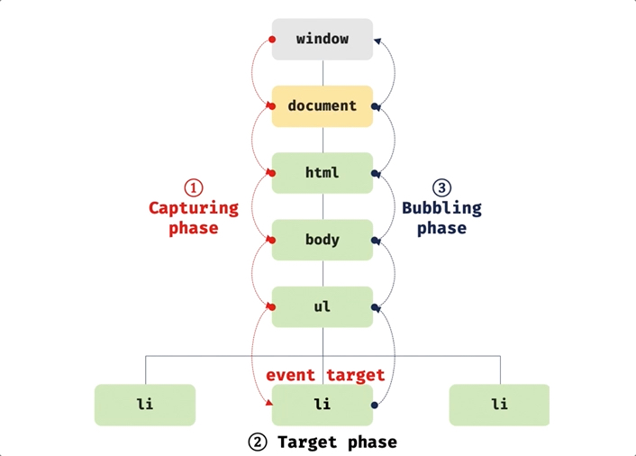

## 40.6 이벤트 전파

- 이벤트 전파: DOM 요소 노드에서 발생한 이벤트는 DOM 트리를 통해 전파
- 이벤트 전파 3단계
  - 캡처링 단계: 상위요소(window -> 이벤트 타깃)에서 하위 요소 방향으로 전파
  - 타킷 단계: 이베트가 이벤트 타깃에 도달
  - 버블링 단계: 이벤트가 하위 요소에서 상위 요소 방향으로 전파
    몇 가지 이벤트는 전파되지 않음: focus/blur, load/unload/abort/error, mouseenter/mouseleave
    따라서 이 이벤트들은 캡처링으로 이벤트를 캐치해야 함
- 이벤트 전파 예시
  - ul에서 자식 요소인 li 클릭 시 클릭 이벤트가 발생
  - 이때 생성된 이벤트 객체는 발생시킨 DOM요소인 이벤트 타킷(event target) 을 중심으로 DOM 트리를 통해 전파

[40_6.html](https://hanam-people.github.io/JavascriptDeepDive/40_Event/40_6.html)

## 40.7 이벤트 위임

[40_7.html](https://hanam-people.github.io/JavascriptDeepDive/40_Event/40_7.html) 코드 참고

## 40.8 DOM 요소의 기본 동작 조작

[40_8.html](https://hanam-people.github.io/JavascriptDeepDive/40_Event/40_8.html) 코드 참고

## 40.9 이벤트 핸들러 내부의 this

[40_9.html](https://hanam-people.github.io/JavascriptDeepDive/40_Event/40_9.html) 코드 참고

### 40.9.1 이벤트 핸들러 어트리뷰트 방식

- 전역 객체 window를 가리킴

### 40.9.2 이벤트 핸들러 프로퍼티 방식과 addEventListener 메서드 방식

- 이벤트를 바인딩한 DOM 요소를 가리킴
- 즉 currentTarget 프로퍼티와 같음

## 40.10 이벤트 핸들러에 인수 전달

[40_10.html](https://hanam-people.github.io/JavascriptDeepDive/40_Event/40_10.html) 코드 참고

## 40.11 커스텀 이벤트

[40_11.html](https://hanam-people.github.io/JavascriptDeepDive/40_Event/40_11.html) 코드 참고

### 40.11.1 커스텀 이벤트 생성

- 이벤트 객체는 이벤트 생성자 함수로 생성 가능
- 이벤트 생성자 함수(Event, UIEvent, MouseEvent) 호출하여 명시적으로 생성하여 개발자의 의도로 생성한 이벤트를 커스텀 이벤트라 한다.
- 이벤트 생성자 함수
  - 첫 번째 인수로 이벤트 타입을 받음
  - 버블링 되지 않으며 preventDefault 메서드로 취소 불가, 즉 bubbles, cancelable 프로퍼티가 false
  - 두번째 인수로 bubbles, cancelable 받아 변경 간으
  - isTrusted 프로퍼티 값은 언제나 false

### 40.11.2 커스텀 이벤트 디스패치

- 생성된 커스텀 이벤트는 dispatchEvent 메서드로 디스패치(dispatch) 메서드에 이벤트 객체를 인수로 전달하여 호출하면 이벤트가 발생됨
-
